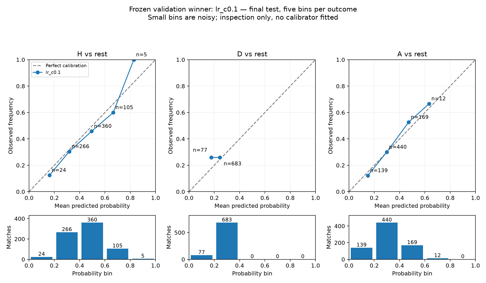

# Premier League Predictor

A reproducible machine-learning experiment that estimates Premier League **home-win, draw, and away-win probabilities** from recent results and scoring form. It compares logistic regression, Random Forest, and XGBoost with a training-frequency baseline and normalized bookmaker odds.

The repository includes validated data provenance, date-safe feature engineering, eight model configurations, frozen fitted pipelines, final-test predictions, calibration reports, and a historical Streamlit dashboard. Explore the [analysis notebook](notebooks/analysis.ipynb) or the [project specification](docs/PRD.md).

## Historical dashboard

After creating and activating the Python environment described below, install the dashboard dependencies and launch:

```sh
python -m pip install -r requirements-dashboard.txt
python -m streamlit run streamlit_app.py
```

Open the local URL printed by Streamlit, normally `http://localhost:8501`. The dashboard provides:

- **Results overview:** saved model/baseline scores, test-season filters, bookmaker coverage, and calculated baseline improvements. Positive reductions indicate lower loss; accuracy gains are percentage points.
- **Historical match explorer:** validation and test fixtures filtered by season/team, H/D/A probabilities, bookmaker comparison, actual scores, and readable pre-match features.
- **Model analysis:** calibration curves with bin counts, a confusion matrix, and outcome-specific performance for the selected model. Feature-attribution explanations are not implemented.
- **Methodology:** chronological splits, feature definitions, leakage safeguards, provenance, and limitations.

The app reads saved forecasts and metrics. Streamlit caches verified data and derived analysis, invalidating the data cache when input files change. It never trains or recomputes model predictions during interaction. The original experiment files and reported test scores remain unchanged.

[data/dashboard/matches.csv](data/dashboard/matches.csv) adds display-only scores, features, and bookmaker probabilities to the saved winning-model predictions. Its [manifest](data/dashboard/manifest.json) records hashes of the snapshot and original inputs. This snapshot allows dashboard use without raw downloads.

To rebuild the display snapshot explicitly from the original hash-verified raw archives:

```sh
python -m src.dashboard_data
```

Preparation reuses `build_features`, the frozen selected pipeline, and `predict_hda` to verify that all 1,140 displayed probability vectors reproduce the saved predictions within `1e-10`. It checks bookmaker test probabilities against their saved forecasts and writes only `data/dashboard/`. This is snapshot preparation, not a match-history refresh or a retraining command.

**Example:** select season **2024/25**, team **Man United**, and **16 August 2024 · Man United vs Fulham**. The historical forecast is H **41.65%**, D **21.87%**, A **36.47%**. H is the most likely outcome, but is below 50%; the result was 1–0 and the individual log loss is **0.875827**. The last-five points means are 1.4 for Man United and 1.0 for Fulham. Displayed rest days of 60 are capped values. These features describe the inputs, not individual causal contributions.

Dashboard checks:

```sh
python -m pytest tests/test_dashboard.py -q
```

This release covers historical forecasts only. Upcoming fixture entry, CSV prediction uploads, and refreshed-history workflows are reserved for stage 2 after review. Historical forecasts are not live predictions or guaranteed outcomes.

## Results

Logistic regression with **C = 0.1** was selected using 2023/24 validation log loss (**0.966052**) before final-test evaluation. The models were fitted only on 2014/15–2022/23 and evaluated without refitting on 2024/25–2025/26.

| Forecast | 2024/25 log loss | 2025/26 log loss | Combined log loss | Combined RPS | Combined accuracy |
| --- | ---: | ---: | ---: | ---: | ---: |
| **Logistic regression, C = 0.1** | 1.014637 | 1.057667 | **1.036152** | 0.214559 | 48.82% |
| Random Forest, depth 8 / leaf 10 | 1.039469 | 1.058497 | 1.048983 | 0.219184 | 48.03% |
| XGBoost, depth 2 / 200 rounds / rate 0.05 | 1.041766 | 1.064878 | 1.053322 | 0.219794 | 47.24% |
| Training frequency | 1.081070 | 1.083292 | 1.082181 | 0.231530 | 41.71% |
| Normalized Bet365 odds | 0.970758 | 1.018547 | 0.994653 | 0.201491 | 51.45% |

Each test season contains 380 matches: **760 combined**, all with valid bookmaker odds. Every forecast is compared on the same fixtures. Lower log loss and RPS are better. The selected model improves on the frequency baseline but has higher log loss than bookmaker probabilities; these results do not establish betting profitability.

Full scores and counts: [test results](reports/test_results.csv), [bookmaker coverage](reports/test_coverage.csv), and [classification reports](reports/test_classification.csv).

### Calibration

The selected model's reliability plots compare predicted probabilities with observed frequencies for each outcome. Five equal-width bins and count bars show the evidence behind each point; small bins are noisy. No calibrator was fitted.



[PDF figure](reports/calibration.pdf) · [Bin statistics](reports/calibration_bins.csv)

## Setup and view saved results

Tested with **Python 3.12.1 on Apple Silicon macOS**. [requirements.txt](requirements.txt) pins the installed dependencies, including pandas, NumPy, scikit-learn, XGBoost, matplotlib, pytest, and ipykernel. The dependency snapshot is specific to that environment; other platforms may require adjustments.

Run commands from the repository root:

```sh
git clone https://github.com/atulrk07/premier-league-predictor.git
cd premier-league-predictor
python3 -m venv .venv
source .venv/bin/activate
python -m pip install -r requirements.txt
```

On Apple Silicon, if XGBoost reports a missing `libomp` library:

```sh
python scripts/setup_macos_openmp.py
```

The helper downloads a pinned, SHA256-verified OpenMP runtime into `.venv/openmp`, retains its license, and adds a local library search path to XGBoost. It requires Apple's `otool` and `install_name_tool`. Rerun it after recreating or moving the environment, or reinstalling XGBoost.

The saved evaluation can be viewed without downloading raw CSVs:

```sh
python -m src.evaluation
```

For this completed experiment, the command verifies the saved pipeline, configuration, dependency versions, source manifest, and output hashes, then displays cached scores. It does not reopen test CSVs or recompute predictions.

### Load data and run the notebook

Raw data is excluded from Git. Download and validate the recorded snapshot:

```sh
python -m src.data --download
```

Each downloaded file must match its SHA256 hash in [data/sources.json](data/sources.json). Provider updates can change archive bytes; a mismatch fails loading instead of silently changing the experiment. Exact replay requires the original recorded snapshot. Once cached, use `python -m src.data` to validate files offline.

Register the notebook kernel:

```sh
python -m ipykernel install --prefix .venv --name premier-league-predictor --display-name 'Premier League Predictor (.venv)'
```

Open [notebooks/analysis.ipynb](notebooks/analysis.ipynb) in VS Code and select the project kernel or `.venv/bin/python`. Run cells in order. The notebook traces features, verifies saved validation predictions, and displays cached final-test reports.

## Data and features

The [Football-Data England archives](https://www.football-data.co.uk/englandm.php) supply division `E0` CSVs for **2014/15–2025/26**. The recorded snapshot contains **4,560 validated matches**, 380 per season. One blank row was removed from 2014/15; no identical duplicates were removed.

The loader parses day-first dates and validates teams, season boundaries, nonnegative integer goals, result labels, and score/result consistency. Fixture keys are season, date, home team, and away team. Conflicting duplicates fail validation. Source URLs, retrieval timestamps, and file hashes are recorded in the manifest; [data_summary.json](reports/data_summary.json) records schemas, exclusions, counts, and date ranges.

Seven features are computed for each team, giving **14 raw numeric inputs**:

| Feature | Definition |
| --- | --- |
| Points mean, last 5 and 10 | Mean match points: win = 3, draw = 1, loss = 0 |
| Goals for / against, last 5 | Mean goals scored and conceded |
| History counts, last 5 and 10 | Actual available matches in each window |
| Rest days | Days since the previous eligible match, capped at 60 |

Both home and away appearances contribute. For a fixture dated `D`, history is restricted to `D - 365 days <= previous date < D`, including history across seasons. Every fixture on a date is processed before that day's results enter history.

Means use the available match count. No history means zero counts and missing means/rest days. Bookmaker odds and current-match goals, shots, cards, and half-time statistics are excluded through an explicit feature allowlist. Median imputation and missing indicators are fitted on training data only; logistic regression also uses training-fitted standard scaling. The saved pipelines receive **24 processed inputs**: 14 features and 10 missing indicators.

Inspect one actual calculation in [feature_trace.json](reports/feature_trace.json).

## Experiment design

| Partition | Seasons | Matches | Purpose |
| --- | --- | ---: | --- |
| Train | 2014/15–2022/23 | 3,420 | Fit preprocessing, models, and frequency baseline |
| Validation | 2023/24 | 380 | Select configurations and model family |
| Test | 2024/25–2025/26 | 760 | Evaluate the frozen selections |

There is no random split or shuffled cross-validation. Earlier validation or test results can update the history for later fixtures, while model parameters and preprocessing statistics remain fixed.

### Model comparison

[config/experiment.json](config/experiment.json) defines eight candidates with seed 42 and one thread:

| Family | Candidate settings |
| --- | --- |
| Logistic regression | `C`: 0.1 or 1.0 |
| Random Forest | 300 trees; `(max_depth, min_samples_leaf)`: (5, 10), (8, 10), (8, 20) |
| XGBoost | `(max_depth, n_estimators, learning_rate)`: (2, 200, 0.05), (3, 200, 0.05), (3, 400, 0.03) |

Select the lowest validation log loss within each family. Among those three candidates within **0.005** of the overall minimum, prefer logistic regression, then Random Forest, then XGBoost. Only logistic regression C = 0.1 qualified in this experiment. The tolerance is a simplicity rule, not a significance test.

All three selected pipelines and the winner decision were frozen before test evaluation. There is no refit on validation data, oversampling, early stopping, or fitted probability calibration. See the [eight-configuration validation table](reports/validation_results.csv), [frequency reference](reports/frequency_validation.json), and [winner decision](reports/winner_decision.json).

### Metrics and baselines

Probabilities use explicit **H/D/A order**, with targets encoded H = 0, D = 1, A = 2.

- **Log loss:** mean `-ln(p_actual)`, with a probability floor of `1e-15`; the model-selection metric.
- **Ranked Probability Score (RPS):** mean of the squared cumulative-probability errors after H and after H+D; a secondary metric dependent on outcome ordering.
- **Accuracy:** fraction of correctly predicted highest-probability outcomes. Classification reports include precision, recall, F1, support, and predicted counts.

The frequency baseline predicts the training proportions `[1533/3420, 804/3420, 1083/3420]` for every fixture. Bookmaker probabilities use `B365H/B365D/B365A`: `p_i = (1/odds_i) / sum_j(1/odds_j)`. All three odds must be finite and greater than one. Invalid odds affect benchmark coverage, not model eligibility; matched comparisons use identical rows for every forecast.

### Example prediction

For **Man United vs Fulham, 16 August 2024**, the frozen winner produced:

| Home win | Draw | Away win | Actual result | Match log loss |
| ---: | ---: | ---: | --- | ---: |
| 41.65% | 21.87% | 36.47% | Home win | 0.875827 |

The full probability vector and 14 input features are in [test_example.json](reports/test_example.json). [test_predictions.csv](reports/test_predictions.csv) contains fixture IDs, labels, splits, probabilities, and odds eligibility for all five forecasts.

## Experiment commands and checks

```sh
# Regenerate training-only baseline and feature reports from cached raw data.
python -m src.metrics
python -m src.features

# Run correctness checks.
python -m pytest -q
```

Initial model fitting uses `python -m src.experiment`, followed by the separate final-test step `python -m src.evaluation`. **The fitting command is intentionally blocked in this repository's completed experiment** once `reports/test_evaluation.json` exists. Preserve the frozen artifacts and evaluation record. Further fitting must use a separately preserved experiment and disclose reuse of these test seasons.

Tests cover data validation, hand-calculated metrics and features, current/future/same-day leakage, chronological fitting boundaries, training-only preprocessing, probability ordering, the selection tolerance, matched benchmark coverage, and frozen evaluation integrity.

## Repository structure

```text
config/experiment.json       Split, features, model presets, and selection rule
data/sources.json            Source URLs, timestamps, and raw-file SHA256 hashes
data/dashboard/              Historical display snapshot and provenance
docs/PRD.md                 Project specification
notebooks/analysis.ipynb     Data exploration, feature trace, and saved results
reports/                    Scores, predictions, fitted pipelines, and figures
scripts/setup_macos_openmp.py  Optional Apple Silicon runtime setup
src/data.py                 CSV loading and validation
src/features.py             Date-safe rolling features and fixture tracing
src/metrics.py              Probability metrics and baseline calculations
src/experiment.py           Training pipelines and validation selection
src/evaluation.py           Frozen final-test evaluation and reporting
src/dashboard_data.py       Prepare and verify the historical display snapshot
streamlit_app.py            Historical results dashboard
tests/                      Methodology and correctness checks
requirements.txt            Pinned dependencies
requirements-dashboard.txt  Original dependencies plus pinned Streamlit packages
```

## Limitations

- One validation season and two test seasons provide limited evidence of stability across seasons.
- Features use EPL results only, excluding injuries, lineups, player strength, and lower-division history; promoted teams can have sparse history.
- The winner selected a draw once out of 197 actual draws in the test set, giving 0.51% draw recall. Probability scores and winner-picking accuracy measure different behavior.
- Historical files may incorporate later provider corrections. Odds collection times differ, and proportional normalization does not establish true fair probabilities.
- Calibration plots and error groups are descriptive; no calibrator was fitted or winner reselected using test performance. Further experiments on these test seasons must disclose reuse.

## Data attribution

Match results and bookmaker odds come from [football-data.co.uk](https://www.football-data.co.uk/englandm.php). See the [provider's column notes and acknowledgements](https://www.football-data.co.uk/notes.txt). Raw downloads are retained locally and excluded from this repository.
